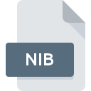

# NibTools

 

## Description

Nib loading and management helpers.

## Installation

Use `Swift Package Manager` to install.

## License

`NibTools` is distributed under the terms and conditions of the [LICENSE](https://github.com/littleigloo/NibTools/blob/master/LICENSE.md).
